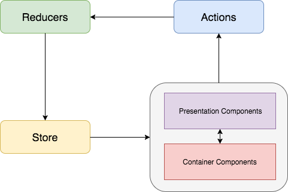

# Basic Redux Tutorial Projects

##### Step 1: Use Redux with simple Reducer
##### Step 2: Use Redux with middleware - Using Redux Logger
##### Step 2: Use Redux with multiple reducers
##### Step 3: Use Redux with async action - Using Thunk Middleware
##### Step 4: Use Redux with async action - Using Promise Middleware
##### Step 5: Build a complete Todo list with React

## Redux Flow

## Libraries Used
[Redux](https://redux.js.org/)

[Redux Logger](https://github.com/evgenyrodionov/redux-logger)

[Redux Thunk](https://github.com/gaearon/redux-thunk)

[Redux Promise Middleware](https://github.com/pburtchaell/redux-promise-middleware)

## To Do

##### Use Redux with multiple promises
##### Use Redux Saga
